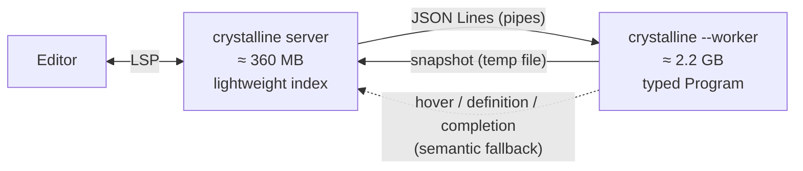
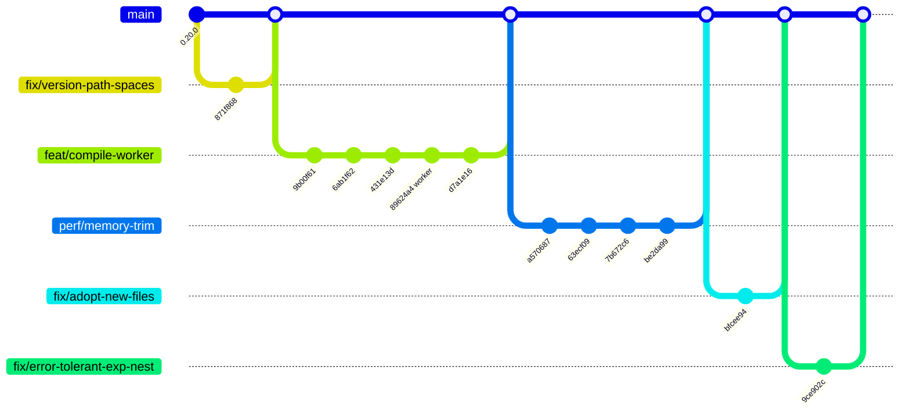

# Refinements on top of 0.20.0

A summary of the changes on this fork since release **0.20.0** (`a5f6f1b`), to help decide
whether they are worth adopting upstream. Each change is a separate, themed commit.

| | |
|---|---|
| Commits | **11** (+ 4 merges) |
| Diff | 24 files, **+1467 / −398** lines (source: +1058 / −392, specs: +387) |
| Reference project | Lucky 1.5 + Avram app — 678 files in `src`, 2069 in `lib` (macOS, Apple Silicon, 16 GB) |

---

## TL;DR

```
Memory footprint (server + worker) after each save, Lucky app, release builds

            0 GB      2         4         6         8        10
            |---------|---------|---------|---------|---------|
0.20.0
  startup   ██████████████████████                              4.4 GB
  save #1   ██████████████████████████████████████              7.6 GB
  save #2   █████████████████████████████████████████████████   9.7 GB
  save #3   ███████████████████████████████████████████████████ 10.2 GB  (another run: killed at 11 GB)

this fork
  startup   ████████████                                        2.5 GB
  save #1   █████████████                                       2.5 GB
  save #2   █████████████                                       2.6 GB
  save #3   █████████████                                       2.5 GB  (flat)
  idle      ██                                                  0.37 GB (after the worker exits)
```

| Metric (Lucky app) | 0.20.0 | Fork | |
|---|---:|---:|---|
| Memory after 3 saves | 10.2 GB – >11 GB | 2.5 GB | **−75%**, no growth |
| Peak during 3 saves | 10.2 GB – >11 GB | 2.6 GB | |
| Idle, 20–45 s after the last save | 10.2 GB, never goes down | 2.5 GB with the worker, **0.37 GB** once it exits | |
| Startup compile | 9.9–10.3 s | 11.4–11.6 s | +1.4 s (process spawn + snapshot) |
| Save #1 | 8.6–9.3 s | 9.0–9.1 s | same |
| Save #3 | 16.0–23.5 s (slows down as the heap grows) | 9.4–9.5 s | **stays flat** |

| Metric (3-file project) | 0.20.0 | Fork |
|---|---:|---:|
| Memory, startup → save #3 | 380 → 675 MB | 254 → 260 MB (server 63–68 MB) |
| Save | 0.4–0.5 s | 0.7 s (process spawn) |

| Behaviour | 0.20.0 | Fork |
|---|---|---|
| New file in the project | false errors | compiled through the entry point |
| Checkout under a path with spaces | build fails | builds |
| A real error in a file | buried under "can't declare def dynamically" in hundreds of files | reported alone |
| Spec suite | — | 360 examples, 0 failures |

<details><summary>How this was measured</summary>

Measured on 2026-09-26: release builds (`crystal build src/crystalline.cr --release --no-debug`) of `a5f6f1b`
(0.20.0), `1e9ad21` (worker only) and `7cc40c6` (this fork), Crystal 1.21.0, macOS on Apple Silicon, 16 GB.
A small Python LSP client sends `initialize`, `didOpen` on one file, then 3 × `didSave` without
content change, waits for each `Building project` progress to end, and samples the
`phys_footprint` of the server and of its `--worker` children every 200 ms. Two runs per binary;
ranges are the two runs. The fork was run with `CRYSTALLINE_WORKER_IDLE_TIMEOUT=30` so the idle row
shows the worker exiting (the default is 300 s; it does not change the save rows).

</details>

---

## 1. The cause: a whole `Program` leaked on every save

A typed `Crystal::Program` is one strongly connected graph (~2 GB). With Boehm's conservative
collector, **a single stale word** pointing into it keeps all of it alive. Three independent
pins were found by emulating Boehm's mark phase:

1. stale pointers in live frames of recycled fiber stacks;
2. struct padding bytes (`Lightweight::MethodInfo`) copied into long-lived arrays;
3. `Crystal::Location#filename` → `VirtualFile` → `Macro` → `Program`.

This is why fixing any one of them alone showed no change: the other two still held the
program. On top of that, the Boehm heap never shrinks back from its peak.

## 2. The fix: type-check in a worker process

`89624a4` — the compile runs in `crystalline --worker`, one process per entry point. When it
exits, the operating system reclaims **all** of its memory, whatever the GC thinks.



- Only **one** `Program` exists at a time: the previous worker is let go before the next compile.
- A new save cancels the compile in flight for the same target.
- An idle worker exits after 5 min (`CRYSTALLINE_WORKER_IDLE_TIMEOUT`, `0` = right after the compile).

Groundwork:

| Commit | What |
|---|---|
| `9b00f61` | index and summary are JSON serializable (locations are flattened to their expansion site, which also fixes go-to-definition lines of macro-generated methods) |
| `6ab1f62` | `compile_with_diagnostics` returns the diagnostics instead of publishing them |
| `431e13d` | hover / definition / completion behind a `Semantic` provider |
| `d7a1e16` | README documentation |

## 3. Trimming what was left

`63ecf09`, `7b672c6` — measured with release builds on the same Lucky app:

| | before (`1e9ad21`) | after (`7cc40c6`) | |
|---|---:|---:|---|
| Server after 2–3 saves | 669 MB | 355–372 MB | −46% |
| Worker holding the program | 2521–2532 MB | 2164–2228 MB | −13% |
| Total peak | 3190–3201 MB | 2593–2646 MB | −18% |
| Save | 10.0–10.8 s | 8.9–9.5 s | −10% |

What changed (allocation and string counts as measured in the commits):

- **Allocation-free summary**: building it allocated 2.3 GB, 1.8 GB of which only to compare the
  restrictions of every pair of overloads. The comparison no longer allocates, and each type
  name is computed once.
- **Streamed summary**: written type by type (180 MB) instead of being built whole first.
- **Interned strings** when reading the snapshot: 2.17 million strings, only 104 k distinct
  → live snapshot in the server goes from **265 MB to 166 MB**.
- **Heap handed back**: the server and the worker call `GC.collect_and_unmap` when they go idle;
  otherwise an idle process never collects and sits on its peak.

`be2da99` — **memory pressure**: an idle worker exits as soon as the OS reports memory pressure
(`memorystatus_vm_pressure_level` on macOS, PSI on Linux, checked every 5 s), freeing ~2 GB.

## 4. Fixes

| Commit | Problem | Fix |
|---|---|---|
| `9ce902c` | One error kept by the error-tolerant compile left the expression nesting off by one: every def, class or module visited after it was reported as declared "dynamically" (one bad line in a Lucky model → 5 819 diagnostics in 917 files, the real error buried among them) | The nesting is captured before each visit and restored when the error is kept; only the real error is reported |
| `bfcee94` | A new file (e.g. a Mosquito job) was compiled on its own, without the project's requires, and reported errors that are not there (`undefined constant Mosquito::QueuedJob`) | The file is looked for from the entry point first; the requires of a failed compile are kept as dependencies too |
| `871f868` | Unquoted `shards version` broke the build under a path with spaces (`/Volumes/SSD 111GB/...` → "Missing SSD") | `__DIR__` is quoted |
| `a570687` | `resolver.cr` not `crystal tool format`-clean | formatted |

---

## History



## Tests

`spec/worker_spec.cr` (new: worker protocol, snapshot, memory pressure, new files, error
cascade), `spec/project_spec.cr`, `spec/workspace_interactive_spec.cr` — **+422 lines** of specs.

## Feature parity with 0.20.0

**No feature was removed.** The LSP controller (`controller.cr`) is byte-for-byte identical to
0.20.0, so the server advertises and handles the same requests. The compiler-backed hover,
definition and completion code was moved as-is from `workspace.cr` to `Semantic::Local`
(`semantic.cr`), and it calls the same `Analysis.*` helpers. The 120 s compile timeout is unchanged.

| Feature | 0.20.0 | Fork |
|---|:---:|:---:|
| Diagnostics on save | ✅ | ✅ (now published from the worker) |
| Lightweight index: hover, definition, completion, symbols, semantic tokens, folding, selection range, highlights, signature help, workspace symbols | ✅ | ✅ (index and summary built in the worker, sent through a snapshot) |
| Compiler-backed fallback (hover / definition / completion) | ✅ | ✅, **with the availability limits below** |
| Formatting (document and range), `--version` | ✅ | ✅ unchanged |
| Checkout under a path with spaces | ❌ | ✅ |
| Files added to a project after startup | ⚠️ false errors | ✅ |

What behaves differently. These are availability changes of the compiler-backed fallback, not
lost features, and they are the price of not keeping a stale ~2 GB `Program` in memory:

| Situation | 0.20.0 | Fork |
|---|---|---|
| While a compile runs | fallback served from the previous `Program` (for files unchanged since then) | fallback unavailable until the compile ends; the lightweight engine keeps answering |
| After a failed compile | previous `Program` kept, still served for unchanged files | no fallback until the next successful compile |
| After 5 min without queries, or under OS memory pressure | `Program` kept forever | worker exits; the fallback comes back on the next save (`CRYSTALLINE_WORKER_IDLE_TIMEOUT` sets the delay; a large value keeps the old behaviour) |

Operational differences:

- Every compile spawns a process (`crystalline --worker`) and writes its snapshot to a temp file
  (~130 MB on the Lucky app, deleted right after it is read).
- The worker inherits `CRYSTAL_PATH` and the rest of the compiler environment from the server.
- `PreludeIndex.generate` (first run per crystalline version only) still compiles in the server
  process.

## Adoption notes

- `fix/version-path-spaces` stands alone. `perf/memory-trim` and `fix/adopt-new-files` build on
  `feat/compile-worker` (the latter changes the worker protocol), so take them in that order.
- Trade-off of the worker: while a compile runs, or after a failed one, the compiler-backed
  fallback (hover / definition / completion misses of the lightweight engine) is unavailable;
  it comes back with the next successful compile.
